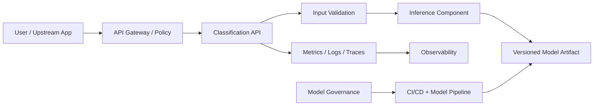
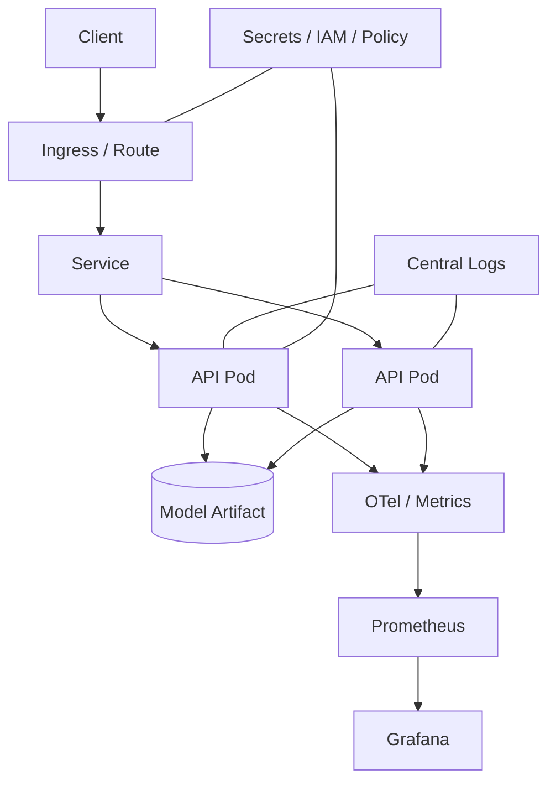

# Architecture

## 1. Enterprise architecture — TOGAF 10 + ArchiMate-inspired view

### Business layer
**Actors:** end user, customer-support/security analyst, product owner, ML engineer, platform/SRE, risk/security.
**Capabilities:** message intake, automated classification, exception handling, audit, model lifecycle, service operations.
**Value:** reduce manual triage while controlling false positives.

### Application layer
Channel/application → API gateway → Text Classification API → Model Runtime. Supporting services provide identity, policy, telemetry, model registry/artifact storage and CI/CD.

### Data layer
Raw messages are transient inference inputs. Training data is separately governed and versioned. Model artifacts, evaluation reports, metadata and audit events have distinct retention policies. Production designs should minimize or redact message content in logs.

### Technology layer
Containers run on Kubernetes/OpenShift. CI builds and tests immutable images. TLS terminates at ingress/gateway. Metrics/logs/traces feed the observability platform. IaC is expressed with Terraform/OpenTofu.

### TOGAF concerns
- **Business architecture:** classification capability, actors, KPIs, exception workflow.
- **Data architecture:** dataset provenance, training/inference separation, retention, privacy.
- **Application architecture:** API, model service, registry/artifact integration, telemetry.
- **Technology architecture:** container platform, networking, IAM, storage, monitoring.
- **Governance:** ADRs, quality gates, security review and model promotion.

## 2. Logical architecture

The gateway owns edge concerns; the application owns schema validation and inference; the model artifact is immutable and versioned. This separation permits independent scaling and model rollback.

## 3. Technical architecture

The learning deployment may use one replica and a local artifact. The enterprise reference uses multiple replicas, PodDisruptionBudget/HPA where justified, registry-backed immutable artifacts, centralized telemetry and gateway authentication.

## 4. C4 views

### C4 System Context
Person → Text Classification System → classification result. External systems: identity provider, observability platform, model lifecycle platform.

### C4 Containers
- API gateway/ingress
- FastAPI classification container
- model artifact/registry
- observability stack
- CI/CD and training pipeline

### C4 Components inside the API
Request schema → validation → model loader/cache → preprocessing/vectorizer → classifier → threshold decision → response schema → telemetry.

## 5. Key design decisions

1. **CPU-first baseline:** small dataset and low inference complexity do not justify GPU cost initially.
2. **Pipeline bundles preprocessing + model:** prevents training/serving skew.
3. **Stateless API:** enables horizontal replication.
4. **Artifact externalization:** production images should reference immutable approved artifacts; bundling is acceptable for the learning path.
5. **Threshold is configurable:** false-positive cost can justify operating away from 0.5.
6. **Cloud-neutral core:** Kubernetes/OpenShift manifests do not depend on a hyperscaler.
7. **IaC dual compatibility:** use conservative HCL compatible with Terraform and OpenTofu where practical.

## 6. Availability and failure design

A failed pod is replaced by the orchestrator. Readiness prevents traffic before the model is available. Enterprise deployments use at least two replicas across failure domains, controlled rollouts and rollback to the previous image/model pair.

## 7. Evolution path

Baseline → transformer benchmark → registry → automated evaluation gate → canary deployment → drift monitoring → retraining workflow.
