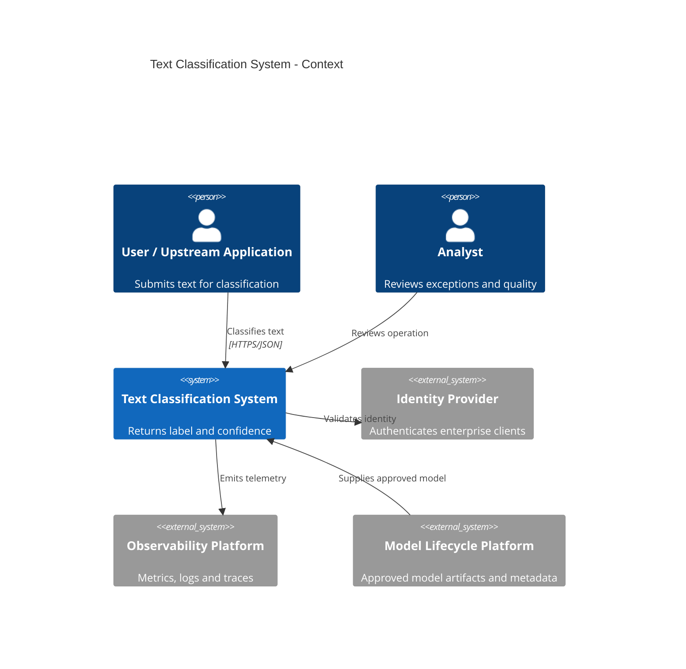
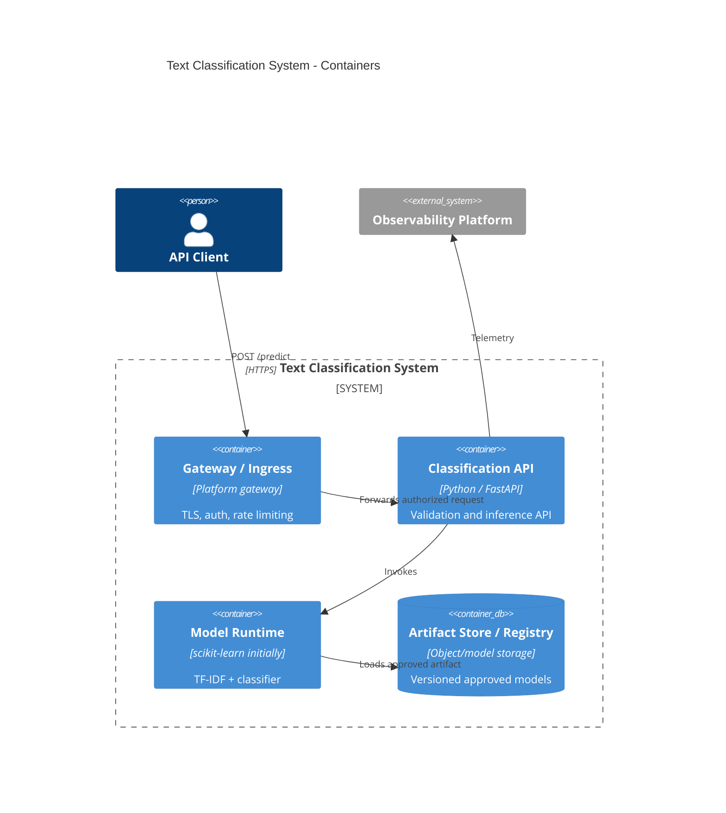
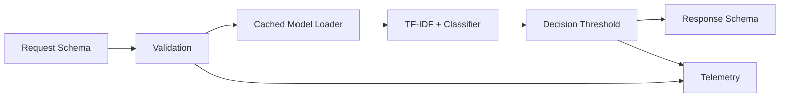

# C4 model

## Level 1 — System Context

```mermaid
C4Context
title Text Classification System - Context
Person(user, "User / Upstream Application", "Submits text for classification")
Person(analyst, "Analyst", "Reviews exceptions and quality")
System(classifier, "Text Classification System", "Returns label and confidence")
System_Ext(idp, "Identity Provider", "Authenticates enterprise clients")
System_Ext(obs, "Observability Platform", "Metrics, logs and traces")
System_Ext(mlops, "Model Lifecycle Platform", "Approved model artifacts and metadata")
Rel(user, classifier, "Classifies text", "HTTPS/JSON")
Rel(analyst, classifier, "Reviews operation")
Rel(classifier, idp, "Validates identity")
Rel(classifier, obs, "Emits telemetry")
Rel(mlops, classifier, "Supplies approved model")
```

## Level 2 — Containers

```mermaid
C4Container
title Text Classification System - Containers
Person(client, "API Client")
System_Boundary(sys, "Text Classification System") {
  Container(gateway, "Gateway / Ingress", "Platform gateway", "TLS, auth, rate limiting")
  Container(api, "Classification API", "Python / FastAPI", "Validation and inference API")
  Container(model, "Model Runtime", "scikit-learn initially", "TF-IDF + classifier")
  ContainerDb(artifact, "Artifact Store / Registry", "Object/model storage", "Versioned approved models")
}
System_Ext(obs, "Observability Platform")
Rel(client, gateway, "POST /predict", "HTTPS")
Rel(gateway, api, "Forwards authorized request")
Rel(api, model, "Invokes")
Rel(model, artifact, "Loads approved artifact")
Rel(api, obs, "Telemetry")
```

## Level 3 — API components

```mermaid
flowchart LR
Schema[Request Schema] --> Validation[Validation]
Validation --> Loader[Cached Model Loader]
Loader --> Pipeline[TF-IDF + Classifier]
Pipeline --> Threshold[Decision Threshold]
Threshold --> Response[Response Schema]
Validation --> Telemetry[Telemetry]
Threshold --> Telemetry
```
